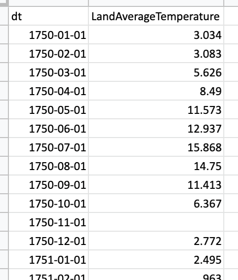
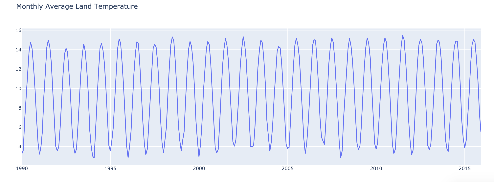
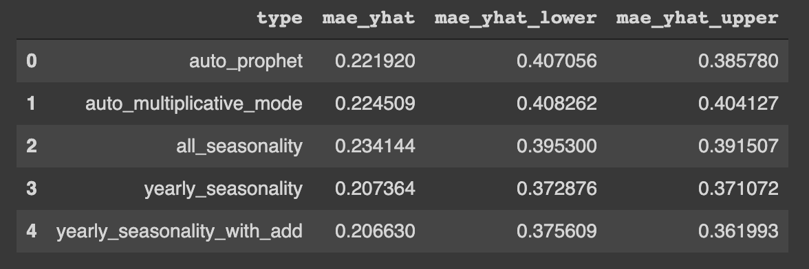
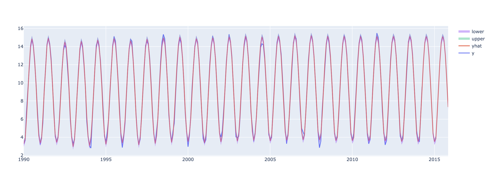

# FORECASTING USING FBProphet

Forecasting Average Land Temperature using FBProphet

## Data Description
The data contain date in avarage land temperature in a month.


Data plot


## Models Tuning
In this project I try tunning the model using 5 different parameters values below : 
--
1. auto prophet : using prophet default parameters values
2. auto multiplicative mode : using prophet default parameter values but change seasonality_mode to multiplicative 
3. all_seasonality : add all seasonality (only try with as previous example in workshop)
4. yearly_seasonality : as we plot we know the data has seasonality yearly
5. yearly_seasonality_with_add : using seasonality yearly and add seasonality_mode to additive

Models dictonary
---
```
models = {"auto_prophet":Prophet(),
          "auto_multiplicative_mode":Prophet(seasonality_mode = 'multiplicative'),
          "all_seasonality" : Prophet(growth= 'linear', 
                           seasonality_mode = 'multiplicative',
                           daily_seasonality= False,
                           weekly_seasonality= False,
                           yearly_seasonality= False).add_seasonality(
                               name='monthly',
                               period=30.5,
                               fourier_order=15,
                               prior_scale=15
                           ).add_seasonality(
                               name='weekly',
                               period=7,
                               fourier_order=10,
                               prior_scale=20
                           ).add_seasonality(
                               name='yearly',
                               period=365.25,
                               fourier_order=20
                           ).add_seasonality(
                               name='quarterly',
                               period=365.25/4,
                               fourier_order=5,
                               prior_scale=15
                           ),
          "yearly_seasonality" : Prophet(growth= 'linear', 
                           seasonality_mode = 'multiplicative',
                           daily_seasonality= False,
                           weekly_seasonality= False,
                           yearly_seasonality= False).add_seasonality(
                               name='yearly',
                               period=365,
                               fourier_order=20
                           ),
          "yearly_seasonality_with_add" : Prophet(growth= 'linear', 
                           seasonality_mode = 'additive',
                           daily_seasonality= False,
                           weekly_seasonality= False,
                           yearly_seasonality= False).add_seasonality(
                               name='yearly',
                               period=365,
                               fourier_order=20
                           )
      }
```

## Result
Models Comparasion
-

<br><br>
From table above we know that the best model is from prophet models that use **seasonality yearly** and **seasonality mode additive**. It's suitable with analysis data above that the seasonality when we plot is yearly and if we observe to the graph we can see thet the seasonality more fitted as additive seasonality rather than multiplicative seasonality. I got excellent explenantion for the difference between additive and multiplicative seasonality mode. <br><br>
<br>
source : https://medium.com/@sigmundojr/seasonality-in-python-additive-or-multiplicative-model-d4b9cf1f48a7

Result plot
-

